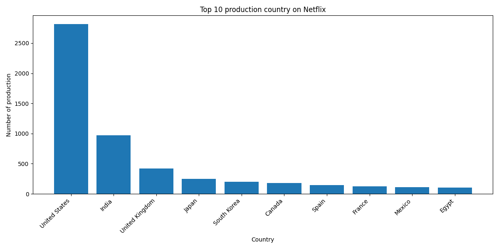
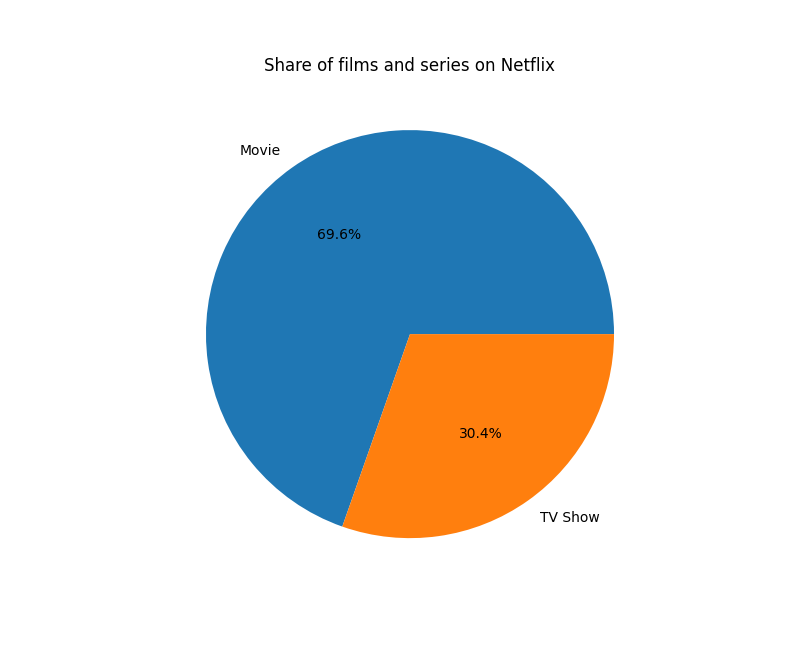
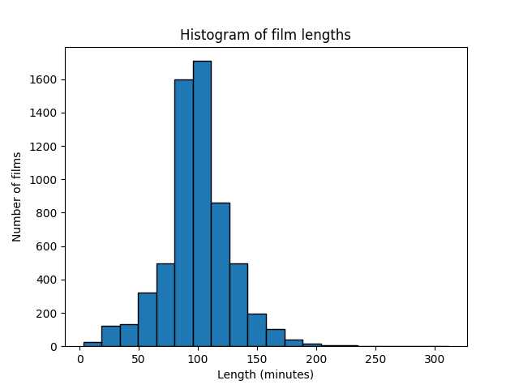
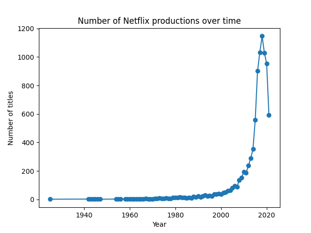

# 🎬 Netflix Data Visualization (PostgreSQL)

An educational project aimed at exploring, learning and visualizing data related to movies and TV shows available on Netflix, using a PostgreSQL database and Python.
---
## 📌 Project Description

The project retrieves data from a PostgreSQL database and executes SQL queries to extract meaningful insights, such as:

Top 10 countries producing the most content
Analysis of the number of productions
Data visualizations in the form of charts

The entire project is designed in a modular way, following good programming practices.
---

## 🧱 Project Structure
```
project/
│
├── main.py              # Entry point of the program
├── db_connection.py     # Database connection handling
├── queries.py           # SQL queries
└── config.yaml          # Configuration data (ignored by Git)
```
## ⚙️ Requirements

Install the required libraries:
```
pip install psycopg2-binary pyyaml matplotlib
```
## 🔐 Configuration

Create a config.yaml file in the main project directory:

```yaml
database:
  host: localhost
  port: 5432
  name: postgres
  user: postgres
  password: your_password
  ```
## 🚀 Run the Project
```
python main.py
```
## 📊 Sample Query
```sql
SELECT country, COUNT(*) AS total_titles
FROM netflix_titles
WHERE country IS NOT NULL
  AND country != ''
GROUP BY country
ORDER BY total_titles DESC
LIMIT 10;
```
## 📈 Sample Results
```
United States: 3000
India: 1000
United Kingdom: 800
...
```
---
## 🖼️ Visualizations

Below are example charts generated in the project:

### 📊 Bar Chart – Top 10 Countries


 🥧 Pie Chart – Share of Movies and TV Shows on Netflix


## 📊 Movie Length Histogram

This graph shows the distribution of movie lengths available in the Netflix database.

- X-axis: movie length in minutes
- Y-axis: number of movies

The histogram allows you to quickly see which time periods have the highest number of productions. This allows you to determine typical movie lengths and identify any outliers.



## 📊 Number of Productions Over Time

The line graph shows the number of films and series added over the years.

- X-axis: year of production (`release_year`)
- Y-axis: number of titles

This graph allows you to observe the dynamics of Netflix's library development and the periods of greatest growth in the number of available productions.



---

## 🧠 Technologies
* Python
* PostgreSQL
* SQL
* YAML
* Matplotlib
---
## 💡 Possible Extensions
Genre analysis
Trend analysis over time
Dashboard (e.g., Streamlit)
API for data retrieval
---
## 👨‍💻 Author

Dariusz Zerynger
Project created for educational purposes and as part of a portfolio.
